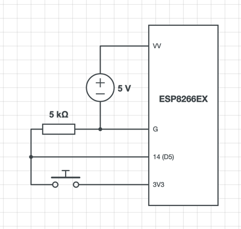

# ESP-Notifier
ESP8266 sketch for [Sv443/Node-Notifier](https://github.com/Sv443/Node-Notifier)

 

## Installation:
1. Set your WiFi settings in `config.h.template`
2. Rename `config.h.template` to `config.h`
3. Set other settings at the top of `ESP-Notifier.ino`
4. Upload the sketch with the Arduino IDE
5. Hook up electronics (see [schematic](#schematic))
6. Start the [desktop client](https://github.com/Sv443/Node-Notifier)

  

## Schematic:

