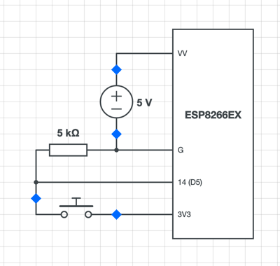

# ESP-Notifier
WiFi enabled IoT button based on ESP8266 - intended to be used with [Node-Notifier](https://github.com/Sv443/Node-Notifier)

 

   

# WORK IN PROGRESS
This is very early software, please tread carefully and at your own risk

  

### Table of contents:
- [Setup](#setup)
- [Example build](#example-build)
    - [Schematic](#schematic)
    - [Parts list](#parts-list)
    - [Instructions](#instructions)
    - [Troubleshooting](#troubleshooting)
- [Legal stuff](#legal-stuff)

Other documents:
- [License (MIT)](./LICENSE.txt)
- [Changelog](./changelog.md#readme)
    - [Planned Features](./changelog.md#planned-features)
- [Security Policy](./.github/SECURITY.md#readme)

  

## Setup:
1. Clone or download and extract this repository (see [releases](https://github.com/Sv443/ESP-Notifier/releases))
2. Rename the file `config.h.template` to `config.h` and open it with a text editor
3. Set your WiFi settings in `config.h` (make sure to adequately protect this file)
4. Start the [desktop client](https://github.com/Sv443/Node-Notifier) and copy its IP address
5. Open the file [`ESP-Notifier.ino`](./ESP-Notifier.ino) in the [Arduino IDE](https://www.arduino.cc/en/software)
6. Install your ESP board in the IDE ([follow this guide](https://arduino-esp8266.readthedocs.io/en/latest/installing.html))
7. Install the library [ArduinoJson](https://arduinojson.org/) in the IDE
8. Edit settings at the top of this file (like the server IP address)
9. Upload the sketch with the Arduino IDE (<kbd>Ctrl</kbd> + <kbd>U</kbd>)
10. Follow the [example build](#example-build) or the [schematic](#schematic)

  

## Example build:
### Schematic:
Follow this schematic to build the base model of ESP-Notifier:  

  
I used an ESP8266EX development board but this should work on any ESP dev board,  
once GPIO pin mappings are changed accordingly in the .ino file.  
  
The blue diamond shape indicates the points where I used headers to make the button and power supply detachable.  
To see the original schematic without these markers, [click here.](./.github/schematic.png)

 

### Parts list:
- ESP8266EX development board (you can also use the non-EX ESP but it's larger)
- a 4.7kΩ resistor
- about 3x4cm of perforated circuit board, matching the size of the ESP dev board
- female and male headers
- a momentary push button (pretty sure SPST or SPDT are the best for this)
- a 5v power supply with at least 500mA (like an old phone charger)

 

### Instructions:
1. > Install the firmware on the ESP (follow the [setup guide](#setup)).

 

2. > Place the resistor on the perforated board, between the ESP's GPIO pin you've chosen (14 aka D5 by default) and  
   > the G or GND pin of the ESP, to act as a pull-down resistor for the switch.  
   > In my example, the resistor is physically sandwiched between the dev board and the perforated board, so the whole thing stays as compact as possible.

 

3. > Hook up the momentary switch between the ESP's GPIO pin you've chosen (default 14 aka D5) and the 3.3V pin of the ESP development board.  
   > If you don't use a development board, you can also probably use the 5V / VV pin.

 

4. > Use the female and male headers to make the button and power wires detachable (optional).  
   > Power headers should be hooked up to the ESP dev board's pins VV or VIN and GND or G.  
   > Button headers are hooked up between chosen GPIO pin (default 14 aka D5) and 3V3 or alternatively the 5V source from the power supply.

 

5. > Hook up the 5V power supply to the VV or VIN pin (+) and the GND or G pin (-) of the ESP dev board.

 

6. > Hook up the button to the headers or directly to the pins described in step 4.

 

7. > Check if it works by pressing the button :)

 

### Troubleshooting:
If something didn't work out for you, please hook up the ESP dev board to your PC, open the serial monitor in the Arduino IDE and check what's going wrong.  
If you still need help, feel free to join my Discord server to ask me:  
  

  

## Legal stuff:

### License:
ESP-Notifier's firmware is licensed under the [MIT License](./LICENSE.txt)

 

### Disclaimer:
This is very early software, please tread carefully and at your own risk.  
Also make sure you adequately protect the `config.h` file, as it contains your WiFi password.

 

### Dependencies:
- [ESP8266WiFi](https://github.com/esp8266/Arduino/tree/master/libraries/ESP8266WiFi)
- [ESP8266HTTPClient](https://github.com/esp8266/Arduino/tree/master/libraries/ESP8266HTTPClient)
- [ArduinoJson](https://arduinojson.org/)

  
  

Made with ❤️ by [Sv443](https://github.com/Sv443)  
If you like ESP-Notifier please consider [supporting me](https://github.com/sponsors/Sv443)

